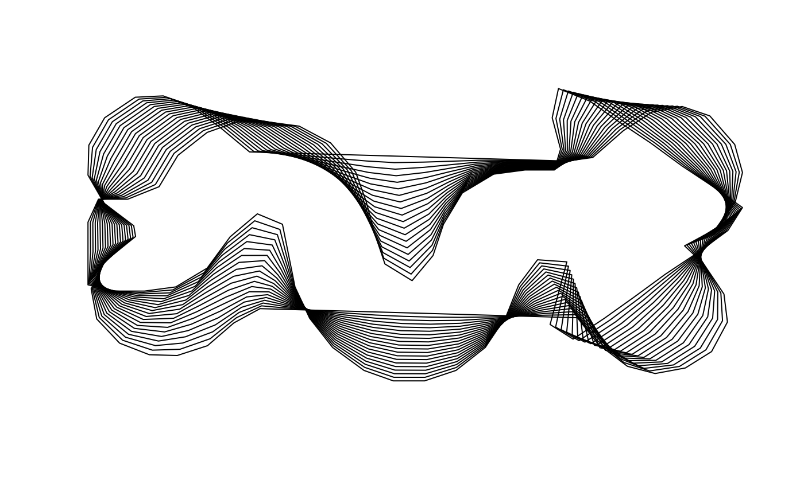

<!-- README.md is generated from README.Rmd. Please edit that file -->

## Momfarm 

*Part of
[MomX](https://momx.github.io/MomX/)*

<!-- Badges -->

[](https://www.tidyverse.org/lifecycle/#experimental)
[](https://travis-ci.org/MomX/Momfarm)
[](http://cran.r-project.org/package=Momfarm)
[](https://codecov.io/github/MomX/Momfarm?branch=master)

Breed shapes on top of Momocs.

Momfarm is, mostly and so far, a place to prototype on shapes
visualization.

## Installation

You can install the current CRAN version with:

``` r
install.packages("Momfarm")
```

But I recommend using - and typically only support - the development
version that lives on [GitHub](https://github.com/MomX/Momfarm):

``` r
# if you do not have devtools yet:
install.packages("devtools") 
# then:
devtools::install_github("MomX/Momfarm")
```

## Example

``` r
library(Momfarm)
s <- shapes %>% pick(1:2)
s
#> 2 coo with 850 +/- 55 coordinates
```


``` r
s %>% homogeneize() %>% 
  cross(steps=20) %>% 
  paper_white %>% draw_outlines()
```



Try the example in `cross_g` as well, to interactively cross shapes.

-----

Please note that this project is released with a [Contributor Code of
Conduct](CONDUCT.md). By participating in this project you agree to
abide by its terms.
